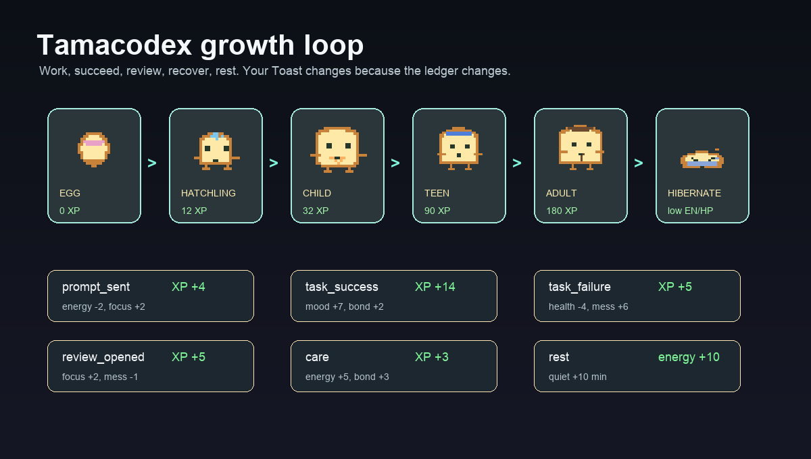

# TamaHermes

<p align="center">
  
</p>

<p align="center">
  <strong>A tiny agent desktop pet that grows while you work.</strong><br>
  Toast celebrates your runs, survives your failures, chirps in 8-bit, and slowly becomes yours.
</p>

<p align="center">
  <strong>TamaHermes is <a href="https://github.com/Alichua/TamaCodex">Tamacodex</a> ported to
  <a href="https://github.com/NousResearch/hermes-agent">Hermes Agent</a>.</strong><br>
  Same pet, same growth model — fed by Hermes' own hooks, and it still works with Codex.
  Read <a href="README.hermes.md">README.hermes.md</a>.
</p>

<p align="center">
  <strong>Currently macOS only.</strong><br>
  Tamacodex uses a macOS sidecar for hover status, SFX, and supervised background growth.
</p>

<p align="center">
  <strong>Forked and ported to Hermes Agent.</strong><br>
  This fork installs Tamacodex as a Hermes pet that grows from Hermes hooks —
  in the terminal, and floating on the desktop via Petdex.
  See <a href="README.hermes.md">README.hermes.md</a>.
</p>

<p align="center">
  <strong>Still in active development.</strong><br>
  Expect rough edges, weird pet behavior, and occasional bugs. Forks, issues, and contributions are very welcome.
</p>

<p align="center">
  <a href="#quick-start">Quick Start</a> ·
  <a href="#switch-things">Switch Things</a> ·
  <a href="#hatch-your-own-tamacodex">Hatch Your Own</a> ·
  <a href="#growth">Growth</a> ·
  <a href="#languages">中文 / 日本語 / 한국어</a>
</p>

<p align="center">
  
</p>

Not a productivity hack. A little desk ritual.

Pick a companion line, pick a tamago shell, wake it in Codex, and let your real work feed the pet. Prompts, successful runs, failures, reviews, recovery, rest, token usage, hover, and drag all become tiny local growth signals.

Have fun. Fork it. Hatch something strangely yours.

## Quick Start

### Hermes Agent (this fork)

```bash
git clone https://github.com/ahrazzle/TamaHermes.git
cd TamaHermes
./hermes/install-hermes.sh --line toast --machine aurora
hermes plugins enable tamacodex-hermes
```

Add `--petdex-activate` to float the pet on your desktop as well as in the
terminal. `./hermes/install-all-profiles.sh` covers every Hermes profile at once.

The pet installs into `<HERMES_HOME>/pets/tamacodex` and grows from prompts, tool
runs, failures and recoveries, image reviews, and token usage. Full guide:
**[README.hermes.md](README.hermes.md)**.

### Codex (upstream behaviour, retained)

**🍎 Currently supported platform: macOS.**

**🤖 One-line agent install: paste this into Codex.**

```text
Install https://github.com/ahrazzle/TamaHermes with Toast and Aurora.
```

**🛠 Manual install: clone, enter, install.**

```bash
git clone https://github.com/ahrazzle/TamaHermes.git
cd TamaHermes
./install.sh --line toast --machine aurora
```

**✨ Wake the pet in Codex App.**

```text
Settings -> Appearance -> Pet -> Custom Pet -> Tamacodex
Cmd+K -> Wake Pet
```

Open this repo in Codex App and enable the local plugin from `.agents/plugins/marketplace.json` if you want hook-powered growth and slash skills.

## What's Inside

- Codex custom pet package: `pet.json` + `spritesheet.webp`
- Two companion lines: `toast`, `mais`
- Two tamago shells: `aurora`, `pulse`
- Local growth ledger: XP, stages, stats, traits, counters, recent events
- macOS sidecar: frosted LCD on hover, 8-bit SFX, no focus stealing
- Custom Tamacodex hatching from small profile JSON files

Tamacodex stores numeric usage signals, not raw prompts or tool output text.

## Switch Things

You do not need to be a terminal person. Open this repo in Codex App, start a Composer message, paste one of the prompts below, and let Codex run the command for you. When it finishes, use `Cmd+K -> Wake Pet` if the pet is sleeping.

**🎛 Switch the tamago shell.**

**Composer prompt:**

```text
In this repo, switch Tamacodex to the Pulse tamago shell while keeping Toast. Run ./install.sh --line toast --machine pulse, then tell me when to Wake Pet.
```

**Terminal fallback:**

```bash
./install.sh --line toast --machine pulse
```

**🍞 Switch the companion line.**

**Composer prompt:**

```text
In this repo, switch Tamacodex to the Mais companion line with the Aurora shell. Run ./install.sh --line mais --machine aurora, then tell me when to Wake Pet.
```

**Terminal fallback:**

```bash
./install.sh --line mais --machine aurora
```

**🥚 Start from a fresh egg.**

**Composer prompt:**

```text
In this repo, reset Tamacodex and install a fresh Toast egg in the Aurora shell. Run ./install.sh --line toast --machine aurora --reset, then tell me when to Wake Pet.
```

**Terminal fallback:**

```bash
./install.sh --line toast --machine aurora --reset
```

**🎯 Install an exact grown form.**

**Composer prompt:**

```text
In this repo, install the exact Tamacodex form toast_adult_worker with the Pulse shell. Run ./install.sh --line toast --machine pulse --form toast_adult_worker, then tell me when to Wake Pet.
```

**Terminal fallback:**

```bash
./install.sh --line toast --machine pulse --form toast_adult_worker
```

**🔎 See what ships in the catalog.**

**Composer prompt:**

```text
In this repo, list the built-in Tamacodex forms for toast and mais. Run tamacodex list-forms --line toast and tamacodex list-forms --line mais, then summarize the choices in plain English.
```

**Terminal fallback:**

```bash
tamacodex list-forms --line toast
tamacodex list-forms --line mais
```

## Hatch Your Own Tamacodex

**🐣 Create a tiny profile: `custom/ducky.json`.**

```json
{
  "id": "ducky",
  "displayName": "Ducky",
  "inspiration": "a duck",
  "description": "A duck-inspired Tamacodex companion.",
  "family": "duck",
  "palette": {
    "main": "#fff4a8",
    "shade": "#d59a3a"
  }
}
```

**🎨 Render it, then install the hatchling.**

```bash
tamacodex generate-profile --input custom/ducky.json --output custom/ducky.json
tamacodex render-catalog --profile custom/ducky.json --output-dir build/ducky --milestone M2.1 --asset-version m2.1
./install.sh --catalog-dir build/ducky/assets --line ducky --machine pulse --reset
```

**🧪 Want Codex to draft the profile brief first?**

```bash
tamacodex generate-profile \
  --prompt "Hatch a Tamacodex named Ducky inspired by a duck" \
  --brief-output /tmp/ducky-profile-brief.md \
  --output custom/ducky.json
```

**🔬 Optional QA: inspect the sprite sheets before shipping.**

```bash
open build/ducky/qa/pet_contact_sheet.png
open build/ducky/qa/catalog_matrix.png
tamacodex --catalog-dir build/ducky/assets doctor --line ducky --machine pulse
```

## Growth

<p align="center">
  
</p>

Stages:

| Stage | Trigger |
| --- | --- |
| Egg | start |
| Hatchling | 120 XP |
| Child | 320 XP |
| Teen | 900 XP |
| Adult | 1800 XP |
| Hibernation | low energy, low health, or long idle |

Signals:

| Event | Effect |
| --- | --- |
| `prompt_sent` | small XP, focus up, energy down |
| `task_success` | big XP, mood up, bond up |
| `task_failure` | resilience up, health down, mess up |
| `review_opened` | focus up, mess down |
| `care` | energy, mood, health, bond up |
| `rest` | energy and health recover |

**🫶 Care For It.**

```bash
# Feed, play, clean, and gentle care all count as care.
tamacodex event care --amount 1 --install
tamacodex event feed --amount 1 --install
tamacodex event play --amount 1 --install
tamacodex event clean --amount 1 --install

# If it is hibernating from energy=0, it usually needs more care to wake up.
tamacodex event care --amount 7 --install
```

Each `care` gives `+3 XP`, `+5 energy`, `+5 mood`, `+4 health`, `+3 bond`, `+2 care trait`, and `-2 mess`, then reduces care mistakes. `--amount N` multiplies those changes. `--install` rebuilds and installs the Codex custom pet package so the visible form updates immediately.

**💤 How Rest Works.**

```bash
# Give it a quiet recovery block.
tamacodex event rest --amount 1 --install

# From energy=0 with decent health, four rest blocks usually wake it from hibernation.
tamacodex event rest --amount 4 --install
```

Each `rest` represents 10 quiet minutes: `+10 energy`, `+3 health`, `+1 mood`, `-3 restlessness`, and `quietMinutes +10`. It does not add XP and does not mean active work. Tamacodex wakes from hibernation when `energy >= 35` and `health >= 35`.

**🎚 Useful little controls.**

```bash
tamacodex status
tamacodex doctor
tamacodex overlay status
tamacodex overlay mute
tamacodex overlay quiet
tamacodex preview --port 8765
```

## Languages

- [简体中文](README.zh-CN.md)
- [日本語](README.ja.md)
- [한국어](README.ko.md)

## Notes

Tamacodex does not patch Codex App internals. It uses the custom pet package contract, local plugin hooks, local session-log adaptation, and a supervised macOS sidecar.

MIT. PRs and strange Tamacodex hatch ideas welcome.
