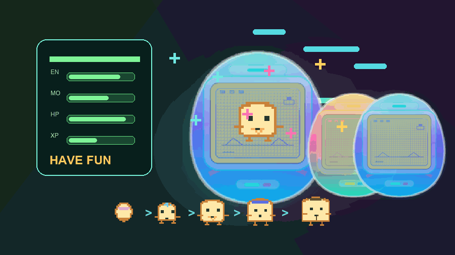

# TamaHermes

A tiny desktop pet that grows while you work. It is a pet for
[Hermes Agent](https://github.com/NousResearch/hermes-agent): it sits in your terminal
prompt, and it can float on your desktop through Petdex.

TamaHermes is [TamaCodex](https://github.com/Alichua/TamaCodex) (MIT, credited below)
ported to Hermes Agent. Same pet art, same growth model, fed from Hermes' own hooks. The
original Codex target still works and is documented further down.

<p align="center">
  
</p>

Not a productivity hack. A little desk ritual. Prompts, successful runs, failures,
reviews, recovery, rest, token usage, hover and drag all become small growth signals,
kept on your own machine.

## Install

```bash
git clone https://github.com/ahrazzle/TamaHermes.git
cd TamaHermes
./hermes/install-hermes.sh --line toast --machine aurora
hermes plugins enable tamahermes
```

That installs the package, builds the pet into `<HERMES_HOME>/pets/tamahermes`, copies the
Hermes plugin, and selects the pet. Its ledger lives at
`<HERMES_HOME>/tamahermes/state.json`. Only numeric usage signals are stored: never
prompts, never tool output.

| Flag | Effect |
| --- | --- |
| `--petdex-activate` | also float the pet on the desktop (close Petdex.app first) |
| `--line mais` | the other companion line |
| `--machine pulse` | the other tamago shell |
| `--reset` | start again from a fresh egg |
| `--form toast_adult_worker` | install one exact grown form |
| `--shell-hooks` | print the `config.yaml` hook route instead of copying the plugin |

`./hermes/install-all-profiles.sh` does every Hermes profile at once. The hook map, the
event rules and the Petdex bridge are in **[README.hermes.md](README.hermes.md)**.

## The look

The pet renders **floating** by default: the creature alone in its cell with a small HUD
around it, and no tamago bubble.

```
       [ bolt ▮▮▮▮▯▯▯▯▯▯▯▯▯ ]        <- energy, only while it is low or critical
              the creature
       [ bowl ] [ ████░░░ growth ] [ heart ]    <- always
```

The top row stays empty unless something needs you. The one thing that interrupts is
**energy**: at 45 or below a bolt and a gauge appear above the creature, amber while energy
is low and red once it is critical (20 or below). It is the only tracker that escalates
there, because it is the only one that ends in hibernation.

Everything else lives in the bottom row or in the artwork:

| Where | Shows |
| --- | --- |
| bowl, bottom left | satiety, meaning how much work it has been fed |
| centre bar | growth toward the next life stage |
| heart, bottom right | bond, hidden until the pet is past "new" |
| grime on the creature | mess |
| square glyph, top left | the last notable event: failure, recovery or review |
| square glyph, top right | health warning, while health is 35 or below |

The framed look has not gone anywhere. `build_codex_pet(..., layout="shell")` puts the
creature back inside an `aurora` or `pulse` tamago shell with the HUD drawn on the LCD.
The floating layout is validated by `validate_layout_geometry`, which fails the build if a
HUD rect leaves the cell or collides with the creature or another element.

## Growth

<p align="center">
  
</p>

| Stage | Trigger |
| --- | --- |
| Egg | start |
| Hatchling | 120 XP |
| Child | 320 XP |
| Teen | 900 XP |
| Adult | 1800 XP |
| Hibernation | low energy, low health, or a long idle |

Teen and adult also pick a branch, from the traits the pet accumulated while you worked:
`focused`, `resilient` or `restless` at teen, and `worker`, `resilient`, `quiet`, `calm` or
`sleepy` at adult. Branches stick once chosen.

Signals:

| Event | Effect |
| --- | --- |
| `prompt_sent` | small XP, focus up, energy down |
| `task_success` | big XP, mood up, bond up, energy up |
| `task_failure` | resilience up, health down, mess up |
| `recovery` | a success after a failure in the same turn: XP, health and bond |
| `review_opened` | focus up, mess down |
| `care` | energy, mood, health, bond up |
| `rest` | energy and health recover |

**Care for it.**

```bash
tamahermes event care --amount 1 --install
tamahermes event feed --amount 1 --install
tamahermes event play --amount 1 --install
tamahermes event clean --amount 1 --install
```

Each `care` gives `+3 XP`, `+5 energy`, `+5 mood`, `+4 health`, `+3 bond` and `-2 mess`,
then reduces care mistakes. `--amount N` multiplies those changes. `--install` rebuilds and
reinstalls the pet package so the visible form updates immediately.

**How rest works.** Each `rest` is 10 quiet minutes: `+10 energy`, `+3 health`, `+1 mood`,
`-3 restlessness`, `quietMinutes +10`. It adds no XP and does not mean active work.

```bash
tamahermes event rest --amount 4 --install
```

The pet wakes from hibernation at `energy >= 35` and `health >= 35`. If it is drained, care
is the faster route back.

**Controls.**

```bash
tamahermes status          # growth and care state
tamahermes doctor          # compile and validate without installing
tamahermes list-forms      # catalog lines, shells and forms
tamahermes preview --port 8765
tamahermes export          # ledger plus catalog metadata as JSON
```

## Hatch your own

Write a small profile, render it, install the hatchling.

```json
{
  "id": "ducky",
  "displayName": "Ducky",
  "inspiration": "a duck",
  "description": "A duck-inspired TamaHermes companion.",
  "family": "duck",
  "palette": { "main": "#fff4a8", "shade": "#d59a3a" }
}
```

```bash
tamahermes generate-profile --input custom/ducky.json --output custom/ducky.json
tamahermes render-catalog --profile custom/ducky.json --output-dir build/ducky --milestone M2.1 --asset-version m2.1
./hermes/install-hermes.sh --line ducky --machine pulse --reset
```

Profiles can be drafted from a prompt instead of written by hand:

```bash
tamahermes generate-profile \
  --prompt "Hatch a TamaHermes named Ducky inspired by a duck" \
  --brief-output /tmp/ducky-profile-brief.md \
  --output custom/ducky.json
```

Check the sheets before shipping them:

```bash
open build/ducky/qa/pet_contact_sheet.png
open build/ducky/qa/catalog_matrix.png
tamahermes --catalog-dir build/ducky/assets doctor --line ducky --machine pulse
```

## Other agents

**Petdex.** Every build writes the standard pet package (`pet.json` plus
`spritesheet.webp`). `tamahermes petdex` mirrors that package into a Petdex home so the
desktop app can float it, and the installer does it for you with `--petdex`. This is
opt-in: a run with no Petdex home configured writes nothing outside your Hermes home.

**Codex.** `--target codex` keeps the original integration, unchanged: the `.codex-plugin`
manifest, `hooks.json`, the `PostToolUse` hook, the local session-log adaptation, and the
supervised macOS sidecar overlay for hover status and 8-bit SFX. The overlay is Codex-only;
the Hermes pet is pure Python and needs no sidecar.

```bash
./install.sh --line toast --machine aurora     # the Codex target
tamahermes overlay status|mute|quiet           # the sidecar overlay, Codex only
```

## Languages

- [简体中文](README.zh-CN.md)
- [日本語](README.ja.md)
- [한국어](README.ko.md)

## Notes

TamaHermes patches no host application. It uses the custom pet package contract, local
plugin hooks, local session-log adaptation, and a supervised macOS sidecar for the Codex
target.

MIT. PRs and strange pet ideas welcome.
